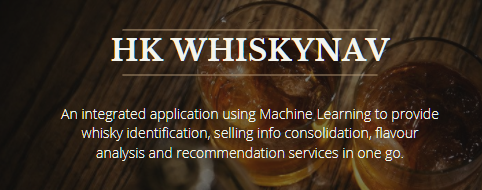
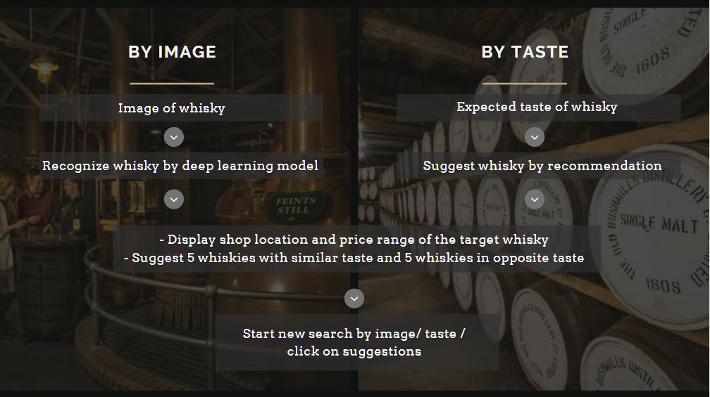

# HK WhiskyNav 

## Project demostration 

https://user-images.githubusercontent.com/80611789/128134094-1f6e007d-0f30-4c33-a44f-ccedf498ba92.mp4

## Table of Contents

- [Project background & aim](#Project_background_and_aim)
- [Application Outline](#Application_Outline)
- [Business Value](#Business_Value)
- [Data Collection](#Data_Collection)
- [Image Recognition](#Image_Recognition)
- [Flavour Analysis & Recommendation System](#Flavour_Analysis_&_Recommendation_System)
- [Challenge](#Challenge)
- [Room for Improvement & future application](#Room_for_Improvement_and_future_application)

## Project_background_and_aim

 

## Application_Outline

User can start their whisky search by  

**Image**  
-Identify the whisky distillery and year by our image recognition model  
 
**Expected whisky flavour**  
-Provide customised whisky recommendation by our recommendation system 
 
After our user choose their target whisky, we will provide the price range, shop address, along with another 5 recommendations of whisky with similar or exact opposite taste to the user. 

Users can further explore other whiskies by clicking on the 5 recommendations or start new search by new images or flavours.

## Business_Value
HK WhiskyNav provides a platform for user to step in the world of whisky. Thus, attracts more people to enjoy and enhance drinking experience.

It also provides an opportunity for cross selling to other whiskies which enhance sales volume. 

Furthermore, Image recognition and recommendation system technique can easily adapt to other products or services.

## Data_Collection
Our data collection consists of four main parts. We created the list for top 100 whisky, whisky image for image recognition model, whisky flavour profile and the availability in HK.  

---------------------------------------------

In data preprocessing, duplicated data was dropped and there 

## Image_Recognition

  

## Flavour_Analysis_&_Recommendation_System
We developed three classification model, Logistic Regression, Random Forest Classifier and XGBoost Classifier with the below model performance.   

In general, XGBoost Classifier better predict the sucessfulness of the project while Random Forest Classifier are slightly more sensitive to positive event as it has a higher recall. Since we would like to know the failure of project in a earlier stage. We chose the XGBoost model for the prediction.   

After fine tuning the XGBoost model, we developed the model at max-depth of 4 with accuracy of 0.69.  

## Challenge
1. Inconsistence of data format  
- Data collection and preprocessing from various sources took longer than we expected as same item may appears in different ways in different places. For example, same whisky may have different name in various website and we spent extra hours to come up with united keys (distillery name and year) to communicate between different sources.  

2. Image Recognition model accuracy 
- A major part of our app is to recognize whisky from photo and a low precision model may disconnect the following function of our app.  However, we lack of images for image recognition model training, especially for those whiskies at a lower ranking. Image augmentation and non-whisky class were introduced to improve the model accuracy.  

## Room_for_Improvement_and_future_application
To further improve the application, we would include data of some global sellers, as we found that there were 6 whiskies out of the top 100 whiskies are not available in Hong Kong local stores. 

Also, user-based recommendation can also be involved to give more variety and subjective recommendation 
Last but not least,   

The flexibility of able to apply the framework to other types of beverages or products creates extra values to this project.  
