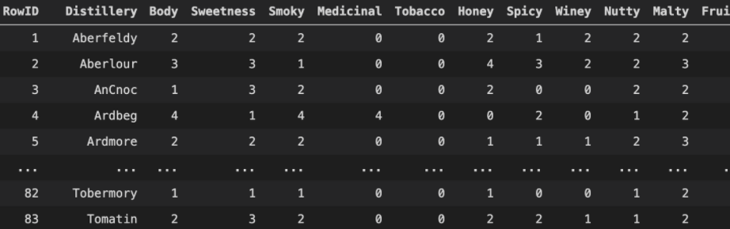

# HK WhiskyNav 

## Project demostration 

https://user-images.githubusercontent.com/80611789/128134094-1f6e007d-0f30-4c33-a44f-ccedf498ba92.mp4

## Table of Contents

- [Project background & aim](#Project_background_and_aim)
- [Business Value](#Business_Value)
- [Application Outline](#Application_Outline)
- [Data Collection](#Data_Collection)
- [Image Recognition](#Image_Recognition)
- [Flavour Analysis & Recommendation System](#Flavour_Analysis_&_Recommendation_System)
- [Challenge](#Challenge)
- [Room for Improvement & future application](#Room_for_Improvement_and_future_application)

## Project_background_and_aim
HK WhiskyNav uses Machine Learning to provide whisky identification, selling info consolidation, flavour analysis and recommendation services in one go. 

User can upload a photo of a whisky bottle, the app then applies Deep Learning technology to distinguish 100 different popular whiskies and identify the correct brand and year. 

After identification, the app then consolidates the information, including price range, name and address of all available shops in HK. 

Furthermore, through Machine Learning, the app can analyse the flavour profile of the whisky and display an easy-to-understand flavour description to the user. 

Through the anaylsis of the flavour profile, the app can also accurately recommend similar whisky, or completely different whisky for user to explore. 

## Business_Value
HK WhiskyNav provides a platform for user to step in the world of whisky. Thus, attracts more people to enjoy and enhance drinking experience.

It also provides an opportunity for cross selling to other whiskies which enhance sales volume. 

Furthermore, Image recognition and recommendation system technique can easily adapt to other products or services.

## Application_Outline

User can start their whisky search by  

**Image**  
-Identify the whisky distillery and year by our image recognition model  
 
**Expected whisky flavour**  
-Provide customised whisky recommendation by our recommendation system 
 
After our user choose their target whisky, we will provide the price range, shop address, along with another 5 recommendations of whisky with similar or exact opposite taste to the user. 

Users can further explore other whiskies by clicking on the 5 recommendations or start new search by new images or flavours. 

## Data_Collection
There are four main parts of data collection in this project. The top 100 whisky, whisky image, whisky flavour profile and the availability in HK.  

We first create a list of the most popular 100 whiskies by web scraping on whisky.com, using distillery and year as the key for each whisky. Since same whiskies may name in differently in different source, this provide a key for us to locate particular whisky in a website and also narrow down the scope which to avoid some niche products that may be hard to get in Hong Kong.  

From the top 100 whiskies list, we collect the images of all whiskies for the deep learning model training. Whiskies images will be under various light sources and backgrounds to help the model better understand the feature of glass bottles. 

We also collected data for the tasting notes of the top 100 whiskies which rated by experts for our recommendation system and reviews from Master of Malt which to visualize the taste to give users a general impression of the whisky by word cloud.  

Last but not least, we also web scrape Wastons wine, Hong Kong Liqour Store and price.com for the availability and price in Hong Kong. Visualize price range by histogram plot and shop list in our application.   

## Image_Recognition
Our original approach was using pre-trained neural network to read the label of the whisky bottle like human distinguish whiskies. However, it failed as it couldn’t even detect the brand ‘Lagavilin’ and the year ‘16’.   

Therefore, we develop our own CNN model using transfer learning of InceptionV3 to classify the whisky based on the whole image.It recognize the features of a whisky bottle, like the shape, colour, position of the label and words on the label.  

Image augmentation was preformed to expand our dataset and non-whisky class was introduced to let the model distinguish the bottle features from the others.   

Model reach 94.7% accuracy after training and training performance and example show as below.  

## Flavour_Analysis_&_Recommendation_System

From the research studying on whisky, 'A Classification of Pure Malt Scotch Whiskies' in 1994 and 'The flavour of whisky' by Dr. David Wishart (PhD Yale) in 2009, we understand that using 12 kinds of flavours is sufficient to describe a whisky taste. The international whisky community has done a survey on whiskies from different distillery, gathered whisky masters from all over the world to rate the whiskies based on the 12 kinds of flavours on a 5-point-scale. This is the database we’ve found.  

However, asking a user to rate all 12 adjectives first before having a recommendation is ridiculous. We would like to reduce the number of flavours being scored. We use principal component analysis, PCA, to explore the possibility of reducing the flavour dimension. But it shows at least 10-dimensionis needed to explain 95% variance of flavours, so 12 is indeed an optimal number and cannot be cut down.  

Therefore, we changed our approach to show 4 adjectives for users to rate and hide the remaining 8 adjectives with deflaut values,unless some dedicated users want to rate them also.  

To find which 4 adjectives is more significant in choosing whisky, we use K-Mean model and elbow method to find the optimal number for clustering. We labelled the 100 whiskies into 4 groups and perform logistic regression to find the weight of each flavour.   

We chose  smoky, winey, honey and fruity as the 4 top adjectives for the flavour search as they have relatively higher correlation and yet easy to imagine the taste in general.   

Cosine distance was used to find the top 5 similar and top 5 opposite recommendation as the balance between the flavours is more important than the strength of individual flavour.   

Word cloud is used to visualize the impression of a particular whisky. Reviews of the whisky are tokenized by TF-IDF and stopword are being removed.   

## Challenge
1. Inconsistence of data format  
- Data collection and preprocessing from various sources took longer than we expected as same item may appears in different ways in different places. For example, same whisky may have different name in various website and we spent extra hours to come up with united keys (distillery name and year) to communicate between different sources.  

2. Image Recognition model accuracy 
- A major part of our app is to recognize whisky from photo and a low precision model may disconnect the following function of our app.  However, we lack of images for image recognition model training, especially for those whiskies at a lower ranking. Image augmentation and non-whisky class were introduced to improve the model accuracy.  

## Room_for_Improvement_and_future_application
To further improve the application, we would include data of some global sellers, as we found that there were 6 whiskies out of the top 100 whiskies are not available in Hong Kong local stores. 

Also, user-based recommendation can also be involved to give more variety and subjective recommendation 
Last but not least,   

The flexibility of able to apply the framework to other types of beverages or products creates extra values to this project.  
